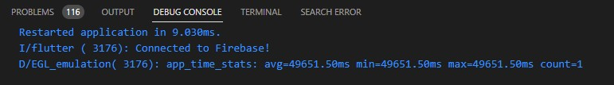

# App de Tarefas

Este é um aplicativo Flutter para testar a função de storage do Firebase

## Funcionalidades

- Adicionar imagens ao Storage Firebase

## Capturas de Tela




## Como Executar

1. Clone este repositório
   ```sh
   git clone https://github.com/BillyTKD/Upload.git

2. Navegue até o diretório do projeto
    cd seu-repositorio.

3. Instale as dependências
    flutter pub get

4. Execute o aplicativo
    flutter run

## Tecnologias Utilizadas
    * Flutter.
    * firebase_core
    * firebase_auth
    * cloud_firestore
    * firebase_storage
    * image_picker

## Autor
    Patrick Santos

       